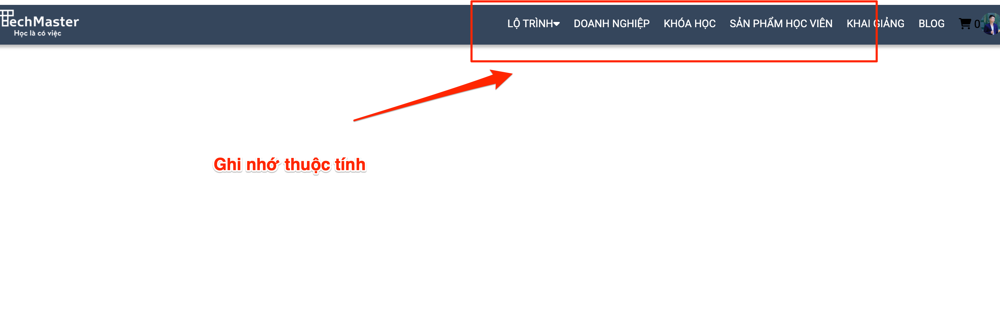

## Giới thiệu về position

Thuộc tính position chỉ định cách một phần tử HTML được định vị trên trình duyệt. Nó đi kèm với các thuộc tính top, right, bottom, left và z-index để chỉ định vị trí hiển thị của phần tử.

Các giá trị có thể đặt cho thuộc tính position:

```html
<div class="logo">
    
</div>
```

```css
body {
    font-family: 'Roboto', sans-serif;
}

img {
    max-width: 100%;
    display: block;
    margin: auto;
}
```

> Muốn sử dụng absolute thì thằng cha phải có thuộc tính position

Tham khảo 1 số thuộc tính position ở đây : https://viblo.asia/helps/cach-su-dung-markdown-bxjvZYnwkJZ


Tham khảo 1 số thuộc tính position [ở đây](https://viblo.asia/helps/cach-su-dung-markdown-bxjvZYnwkJZ)

Các thuộc tính của postion:

- Relative
- Fix

Các thuộc tính của postion:

1. Relative
2. Fix

Ghi nhớ

